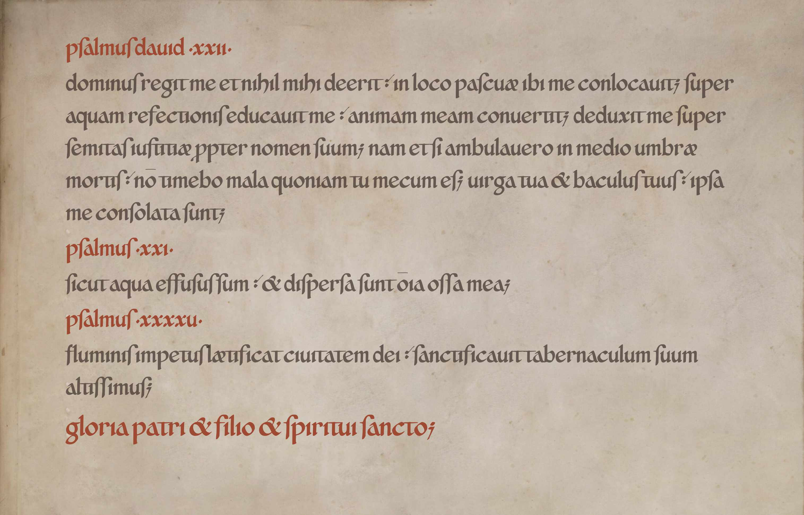

# Heldenlied Minuskel

A Carolingian minuscule typeface inspired by and modelled on the Folchart Psalter
(St. Gallen, Stiftsbibliothek, Cod. Sang. 23, 9th century), created for
the tabletop RPG *Heldenlied – Das Schicksal der Helden*
(https://heldenlied-rpg.de).

Designed for display use: titles, logos, handouts and atmospheric text,
not body text.

Background: edited from St. Gallen, Stiftsbibliothek, Cod. Sang. 23, p. 215:
Folchart-Psalter (https://doi.org/10.5076/e-codices-csg-0023), licensed under
CC BY-NC 3.0. The specimen image is not covered by the OFL.

## Status

Version 0.3 – First public release

## OpenType features

| Feature | Description |
|---------|-------------|
| `liga`  | Standard ligatures |
| `calt`  | Replace s with long s (ſ), ss with z/ß, Numbers 1-100 with Roman numerals |
| `ss01`  | Tall ascenders |
| `ss06`  | Modern readability (two-dot umlauts, modern v/w/j, digits, ß, s) |

## Usage in LaTeX (fontspec)

    \newfontfamily\minuskel{HeldenliedMinuskel-Regular.otf}
    {\minuskel\addfontfeature{StylisticSet=6} Text}

## Source

Glyphs are drawn in Inkscape (`sources/svg/`) and assembled in
FontForge (`sources/Heldenlied-Minuskel-Regular.sfd`).

## Development notes

All glyphs are drawn by hand with pen and ink, scanned and vectorised
by the designer. Design decisions and historical interpretation are
based on the designer's own study of the Folchart Psalter.

Claude (Anthropic) was used as an assistant during development: for
analysing font files, explaining and debugging OpenType features, writing
helper scripts, background research on historical letterforms, and
drafting documentation. No glyph outlines were generated by AI.

## License
Copyright 2026 Richard Westebbe (https://github.com/heldenlied-rpg/heldenlied-minuskel-font), 
with Reserved Font Name "Heldenlied Minuskel".

This Font Software is licensed under the SIL Open Font License,
Version 1.1. See [OFL.txt](OFL.txt).

Historical source: Cod. Sang. 23 via e-codices (https://www.e-codices.ch).